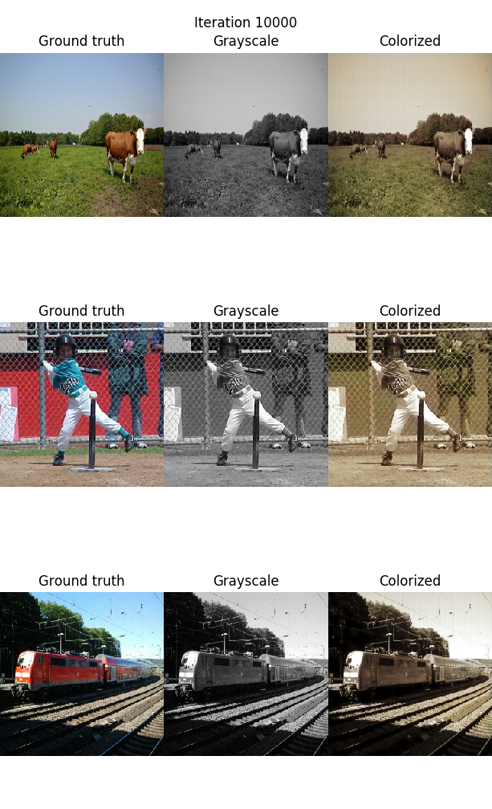
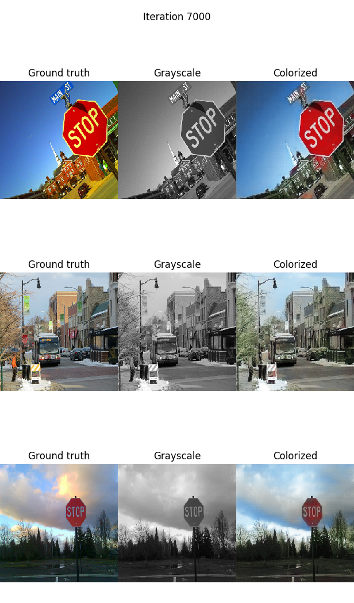
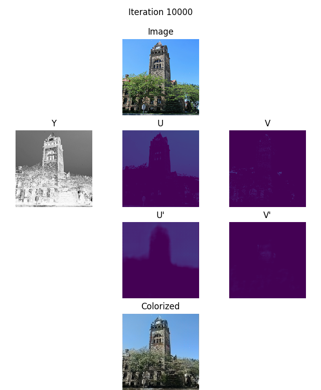
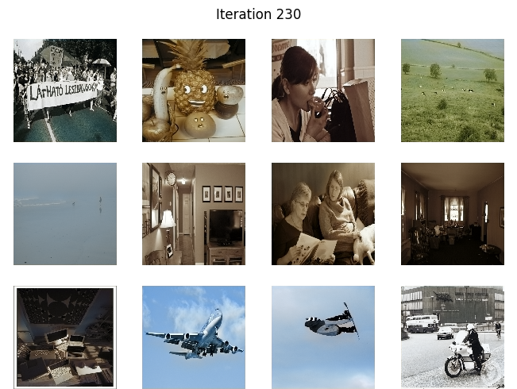

# colorize

Lets colorize grayscale images!

Following my [attempts](https://github.com/psaikko/tf-style-transfer) at replicating results of style transfer research, I wanted to train a similar convolutional network for colorizing grayscale images. 

In contrast to the style transfer experiments, we can objectively quantify the accuracy of our results. We also have access to endless amounts of training data, since we can desaturate any image to get a pair of monochrome and colorized images.

## installation

```
python3 -m venv venv
source ./venv/bin/activate
pip install --upgrade pip
pip install -r requirements.txt
```

## results

As a first step, we replace the instance normalization used for style transfer with the usual batch normalization. Unlike in style transfer, we care about the relative brightness of images and want to produce a different result for a dark image. 

The CNN learns to color images mostly in a dull brown tone:



To test if the CNN is at all suitable for the task, lets try a slightly easier problem. The COCO dataset is quite diverse, so lets try learning to color a more homogenous set of images. 

Training on only images containing stop signs gives more encouraging results:



Not only do all images have an easy to recognize object, they are all taken outdoors and lit mostly by sunlight. This further reduces the variety that the network must learn to account for.

Now that we see some promising signs, lets take inspiration from recent published papers on the topic. For example:

- [Baldassarre et al. 2017](https://arxiv.org/pdf/1712.03400.pdf)
- [Iizuka et al. 2016](http://iizuka.cs.tsukuba.ac.jp/projects/colorization/data/colorization_sig2016.pdf)

In both papers an alternative color space (L\*a\*b\*) is used and the reconstruction process is augmented with global image features. 

First lets replace our RGB color space. For convenience, we use YUV instead of L\*a\*b\*, because tensorflow supports conversions between RGB and YUV. The effect is roughly the same: we separate the brightness (luminance) and color (chrominance) information. 

- Input: Luminance channel Y
- Output: Chrominance channels U,V

Since the chrominance data is expressed in just two channels (U and V) instead of three (RGB), the learning task should be easier. 

Testing again with the stop sign images to check that we didn't break anything:



Next we use a pretrained network (tf.keras.applications.ResNet50) as a feature extractor for global image features. A copy of the feature vector is stacked onto each pixel in a middle layer of the CNN (the "fusion layer").

Incorporating global information gets us a bit closer to reasonable results over the whole COCO dataset. We now see green grass, blue sky, and even a yellowish pineapple:



## todos

- investigate memory issues
- precompute feature vectors
- verify that images are correctly preprocessed for pretrained resnet classifier